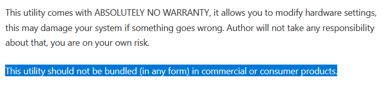
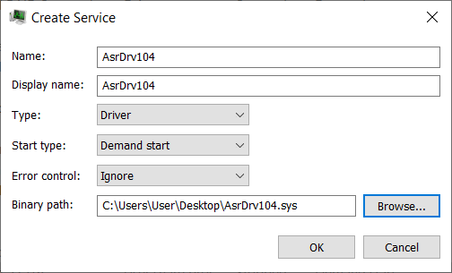
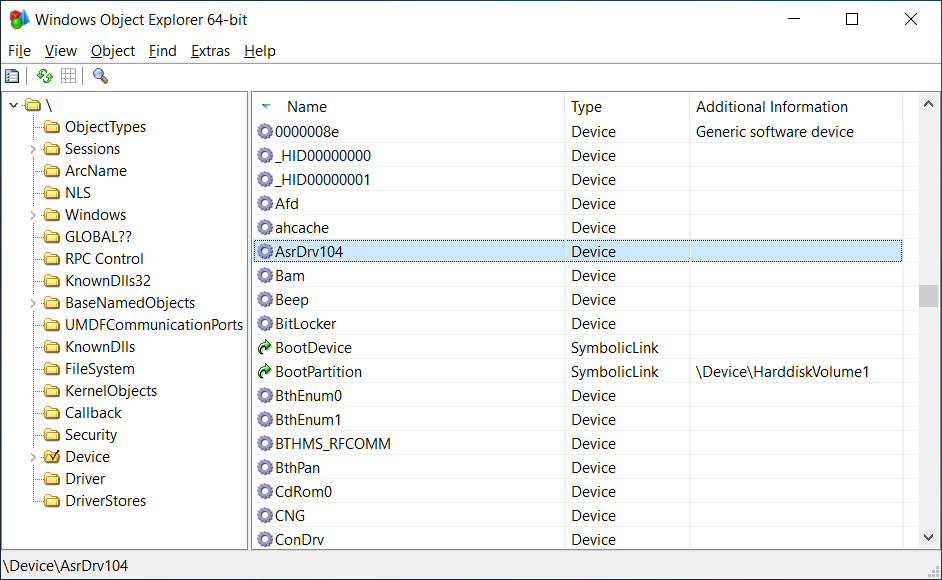
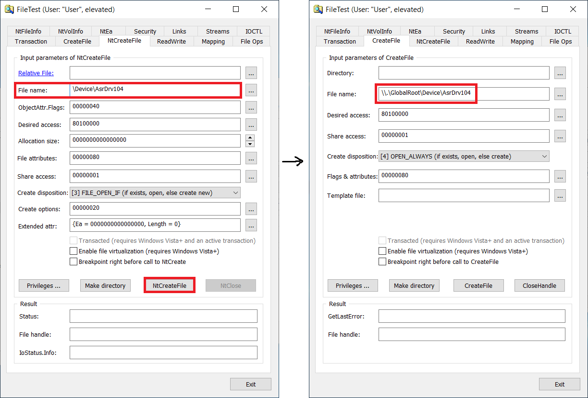
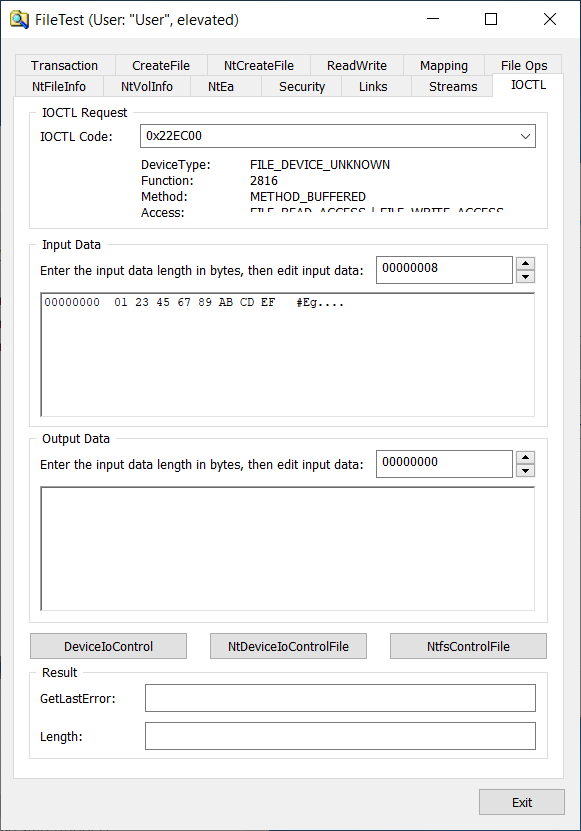
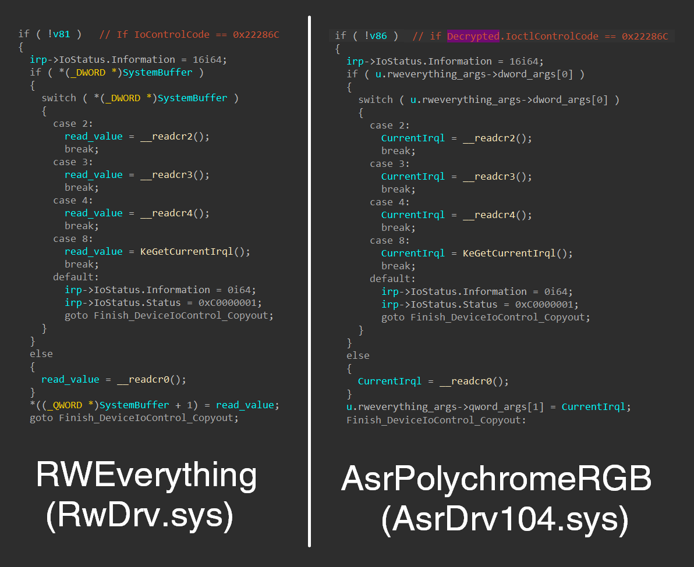
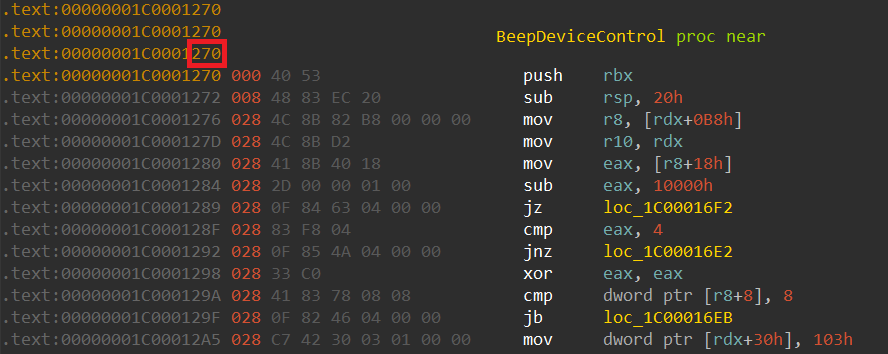

# How to exploit a vulnerable windows driver

Exploit and Proof of Concept (PoC) for [CVE-2020-15368](https://cve.mitre.org/cgi-bin/cvename.cgi?name=CVE-2020-15368). Asrock repackaged rweverything driver for their RGB controller configuration tool and signed it. They "protect" it by encrypting their ioctls...lol. We found this CVE by accident last summer, and afaik the driver still isn't patched. The impact is of course arbitrary code execution in kernel, etc. So enjoy this "0day" lol.

If you want to argue with me on whether it's a REAL BONA FIDE CVE, please feel free to reach out to me on Twitter, we can have a huge fight on public social media and it will be really exciting for everyone involved! I will even buy a domain for this bug if you are so inclined. it's all about marketing!!!!

**Anyways, this bug is pretty shit, so I'm going to use it as a tutorial on how to pwn your typical vuln driver. So this post is aimed towards beginners.** You'll learn how to exploit a vulnerable driver. There are tons of other shitty drivers out there like this. The world is your oyster. Have fun

**DISCLAIMER: This publication is provided for educational purposes only. It is the reader's responsibility to obey all applicable local, state and federal laws. The author(s) of this publication assume no liability and are not responsible for any misuse or damage caused by the software contained in this publication.**

## Backstory

Stuck in quarantine, my roomates ([Pear0](https://github.com/Pear0), [Codetector](https://github.com/codetector1374)) and I were fooling around on Pear0's new Asrock motherboard. The bright red LEDs were extremely annoying and it was not possible to configure them on Linux. Thus our plan was to reverse the Windows driver that controlled it and replicate the I/O operations on Linux.

Long story short, it didn't take long until we realized the driver is literally just a generic driver granting arbitrary read/write access to anything. This includes control registers like CR3, CR4, physical memory, etc. Drivers like this are [intended for use as a debugging tool](http://rweverything.com/) and the vendor's website clearly states so.



We thought this was extremely funny. It's quite exciting the first time you make a computer triple fault and hard reboot from userspace. (Maybe less exciting the 20th time.) Anyways, we reported the bug then forgot about it for a year.

## Setup

As a kernel noob, I was wondering how to actually load and interact with the driver. Turns out it is extremely easy.

You can just create a service for the driver in [Process Hacker](https://processhacker.sourceforge.io/) (obviously, requires admin to load drivers). Then you can just right click and start it. Yes it's really that simple.



We can view our Device object in [WinObjEx64](https://github.com/hfiref0x/WinObjEx64).



We can even play with the device in [FileTest](http://www.zezula.net/en/fstools/filetest.html).





All of these 3 tools are amazing, especially PH and FileTest. They are like a Swiss army knife and they ought to be in every Windows reverser's toolbox. For example, from my understanding [Jonas L](https://twitter.com/jonasLyk) has found countless Windows LPE vulnerabilities just dicking around in FileTest. So Windows really has some great tools for fucking around. I wish there was this shit on Linux.

## "Security" bypass

Rweverything has an ioctl that takes an ioctl as a parameter, which controls what operation to perform (read mem, write mem, read msr, etc.), and a union of some operation-specific parameters like src address, dst addr, etc. When we compare the two drivers' code:



🤔🤔🤔🤔🤔🤔🤔🤔🤔

Nevertheless, the driver makes a shoddy attempt at security by obscurity by requiring that all ioctl calls be appropriately encrypted with a hardcoded AES key. The code (after some cleanup) looks like this:

```cpp
if ( IoControlCode == 0x22EC00 )
{

  char enc_key[32];
  memset(enc_key, 0, sizeof(enc_key));
  memmove(enc_key, "C110DD4FE9434147B92A5A1E3FDBF29A", 32ui64);
  memcpy(enc_key + 13, ioctl_args->key, 16);
  
  size_t cb_decrypted = 0;
  my_decrypted_cmd* decryptedCmd = NULL;
  DWORD iv_size = ioctl_args->iv_size;
  DWORD input_size = *(DWORD*)(ioctl_args + bufferLen - 6);

  // really just calls BCrypt API to get an AES implementation
  if ( (unsigned int)decrypt_ioctl_params(enc_key, 32, ioctl_args->iv, iv_size, ioctl_args + bufferLen - input_size - 6, input_size, &decryptedCmd, &cb_decrypted) )
  {
    // Decryption failed
    if ( decryptedCmd )
      ExFreePoolWithTag(decryptedCmd, 0);
    irp->IoStatus.Status = 0xC000000D;
    goto Fail_Out;
  }
  IoControlCode = decryptedCmd->opcode;
  Rweverything_Args = &decryptedCmd->args;
}
else // not 0x22EC00
{
  if ( IoControlCode != 0x22E858 &&
       IoControlCode != 0x22E860 &&
       IoControlCode != 0x22E800 &&
       IoControlCode != 0x22E804 )// whitelisted control codes
    IoControlCode = 0; // block everything else
}
```

The driver allows some boring operations that do some PMIO but all of the "fun" control codes are gated behind this decryption routine. Despite having this explicit allow-list, it still includes all of the dangerous Rweverything functionality. Instead of hiding these dangerous features, they probably should have just been removed altogether.

Also, interestingly, it also allows the user to specify part of the key (???), for what reason I have no idea. The code is just very poorly written.

Anyways, it's relatively easy to write the client code to use this weird encrypted API and pass it arbitrary ioctl calls we want. I won't bore you with the details of that.

## Talking to the driver

We open a handle to the driver and use DeviceIoControl to call the ioctl, very standard stuff.

```cpp
HANDLE hDevice = CreateFileA("\\\\.\\GlobalRoot\\Device\\AsrDrv104", GENERIC_READ | GENERIC_WRITE | SYNCHRONIZE, FILE_SHARE_READ | FILE_SHARE_WRITE, NULL, OPEN_EXISTING, FILE_ATTRIBUTE_NORMAL, NULL);

// ... set up the encrypted ioctl data

BOOL result = DeviceIoControl(hDevice, 0x22EC00, ioctl_data, in_buf_size, out_buf, sizeof(out_buf), &bytes_returned, NULL);
```

Now that we are able to talk to the hidden Rweverything part of the driver, the first thing I wanted to do was trigger a crash so that I know my driver client is working.

The most straightforward way to accomplish this is to overwrite CR3 with junk. I know some of you reading this are noobs and that's OK so I will explain in detail. I am stupid too so maybe this will help you learn. If you know what you are doing then you can skip this.

On x86, when paging is enabled (pretty much all the time in any modern operating system), CR3 points to the physical base address of the top level page table directory. If you don't know what that means go read the Wikipedia article for Virtual memory.

When we overwrite CR3 with junk, say 0x0000000000000000, the TLB gets flushed, and upon attempting to execute the next instruction, the processor (specifically the MMU) will try to translate the instruction pointer to a physical address. Address translation can be thought of as essentially a series of pagetable walks starting from CR3. CR3 now points to physical memory at 0, which *does* exist and is accessible; however it is extremely unlikely that is a valid pagetable. (Pagetable entries, or PTEs for short, have a specific structure they must follow.)

When this happens, we will get a page fault on the address translation. Now, normally the CPU would take us to the addresss of the page fault handler. But how does it know where the page fault handler function is? This is stored in a memory data structure known as the Interrupt Descriptor Table (IDT). The processor has a register (read/written by `sidt` and `lidt` instructions) which holds the *virtual* address of the IDT. Do you see the problem now? To handle the page fault we need to first do yet *another* virtual memory access, and hence yet another address translation.

Of course, our second address translation will also fault. Now we have a Double Fault: a fault that occurs while handling the first page fault. This is quite serious but still recoverable---the processor will give us one last chance to recover. Of course, this attempt is also cut brutally short with a third and final page fault, a Triple Fault. At this point, the CPU just gives up and hard resets the machine. If you performed this procedure on a physical machine, you would probably see your BIOS splash screen about now.

Now if you have any questions I will give you the same answer that was always given to me. Which is to go read the Intel Manual Volume 3A. (aka the Bible).

## Exploiting the driver

OK, now how do we actually exploit the driver? Looking around, we see a free arb physical memory r/w primitive. It basically maps whatever physical address you want using `MmMapIoSpace`, copies your buffer to it (or vice versa), and unmaps the address.

> Small note: when you try to call `MmMapIoSpace` with some stupid arguments like us while kernel debugger is attached, you will bugcheck. You can bypass this by writing a magic byte in WinDbg. Look for comment referencing `MiShowBadMapper` in exploit.cpp to see more. I don't really know what that shit is about and I don't care to find out really

How can we leverage this primitive to get code execution in the kernel? The main problem with this primitive is that it operates on *physical* memory. As a usermode program, we pretty much have no idea what the layout of *physical* memory looks like---the operating system handles all of that for us. Even if we can get virtual addresses of some kernel data structures or kernel function pointers, we have no idea where they are in physical address space.

One idea is to read CR3, read the page tables, and perform the virtual address translation ourselves. This is a great idea. It does not work. This is because Windows no longer allows you to map page tables with `MmMapIoSpace`. So we need to get more clever.

I used the xeroxz's technique from [VDM](https://githacks.org/_xeroxz/vdm). It's pretty simple, but the technique is quite clever. Although we don't know the *layout* of physical memory, we can still scan all of the physical memory until we find what we're looking for. One thing we can leverage is that page contents' are always the same both physically and virtually: any offsets relative to page boundaries are always preserved. For example, if I have page `0x7fff000000000XXX` mapped to physical frame `0x0000000123456XXX`, the `XXX` of all addresses is same in both physical and virtual address. All of the intra-page structure is preserved; thus we can scan for some interesting *page* we would like to overwrite.

The easiest thing we can overwrite is probably some easy-to-reach syscall or ioctl handler. On Windows, there is a standard `Beep()` function that makes your computer beep. Believe it or not, this is implemented in a driver, Beep.sys which provides the Beep device. (In fact, you can see it in the WinObjEx64 screenshot from earlier.) Anyone can use the Beep device, and it's rarely called. So let's overwrite the Beep ioctl handler.

We can pop Beep.sys into IDA and check out the DeviceIoControl handler.



At page offset 0x270, we have this code with bytes `40 53 48 ...`. None of these bytes are relocated, so scanning for this function is very easy. If there were relocated bytes, we would need to wildcard them out. It's the same idea as signature scanning when you're writing some game hack.

So after we've scanned physical memory to locate this code, we can just overwrite it with our own shellcode. You also have to be careful as there may be multiple copies of this page lying around in physical memory (!) so go find all copies.

At this point, we can quite easily escalate privileges by swapping our process' security token with one of a system process to get `nt authority\system` permissions. Unfortunately the asrock driver requires admin permissions to open anyways, so this is not very interesting.

For us, we write a basic shellcode that allocates and copies a stage 2 payload, then spawns a new kernel thread. We can't do everything in our overwritten Beep handler as 1) we're limited to 1 page and 2) we will crash the system when we try to close our handle to the Beep device, as we also trashed the rest of the code in the beep device. As for getting kernel pointers, this is actually easy because NtQuerySystemInformation will give them to us for free if we ask nicely.

```cpp
__int64 __declspec(dllexport) __fastcall MyIRPHandler(struct _DEVICE_OBJECT* a1, IRP* irp)
{
    MyIrpStruct* user_data = (MyIrpStruct*)irp->AssociatedIrp.SystemBuffer;

    void* my_rwx = user_data->nt_ExAllocatePoolWithTag(NonPagedPoolExecute, user_data->payload_size, 'lmao');

    user_data->nt_memcpy(my_rwx, user_data->payload, user_data->payload_size);

    HANDLE hThread;
    user_data->nt_PsCreateSystemThread(&hThread, THREAD_ALL_ACCESS, NULL, NULL, NULL, (PKSTART_ROUTINE)my_rwx, NULL);

    user_data->nt_IofCompleteRequest(irp, 0);

    return 0;
}
```

So we quickly patch Beep, call the overwritten ioctl handler, and unpatch Beep. Now we have safely created a kernel thread executing our code without trashing anything else on the system. At this point we can map our own drivers or whatever.

# Conclusion

I am a bad security researcher and I only find worthless bugs, by accident. Thanks for reading everyone. Please subscribe to my [OnlyFans](https://onlyfans.com/basteg0d69)
